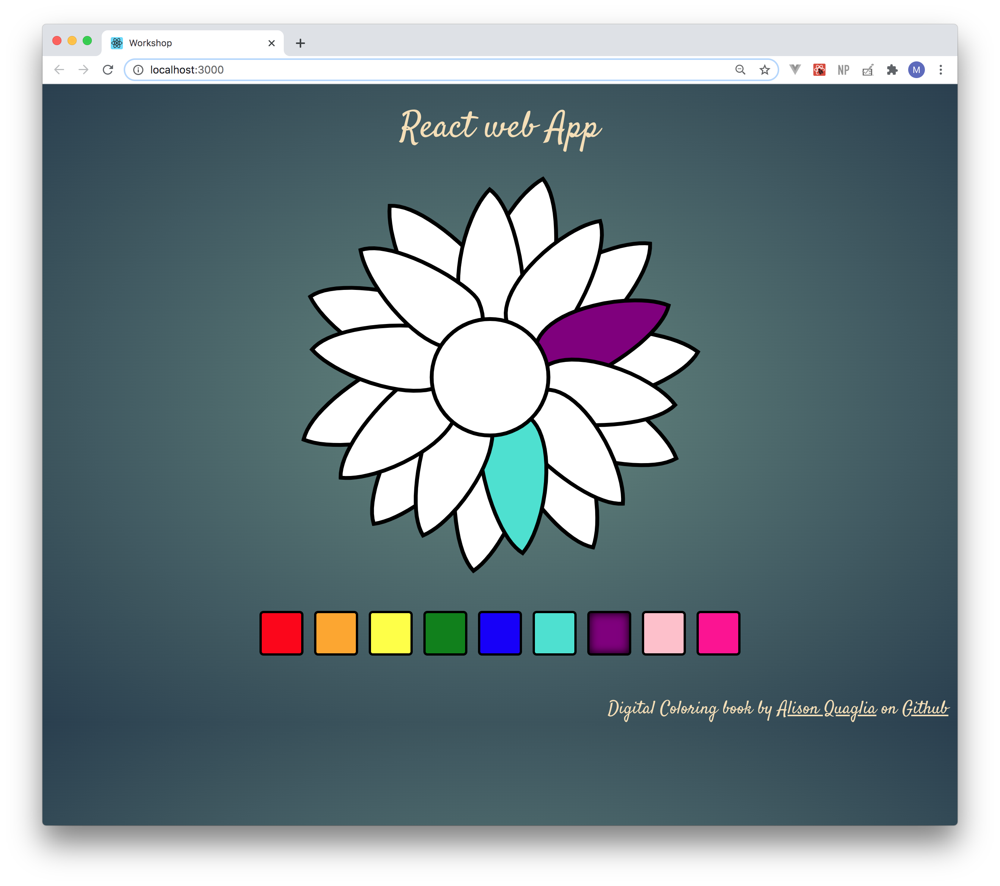

##### Getting Started
For this workshop clone this repo by running command:
`git clone https://github.com/buingocanhkma/codestar.git`

##### Build the image  

`docker build -t workshop:latest .`

##### Run the container locally

`docker run -it -p 8080:80 workshop:latest`

During the workshop we will create a private registry on AWS, then push image to `workshop` repository.
Then we will provision infrastructure on AWS using Terraform (for this step go to this [repo](https://github.com/buingocanhkma/codestar.git)).

